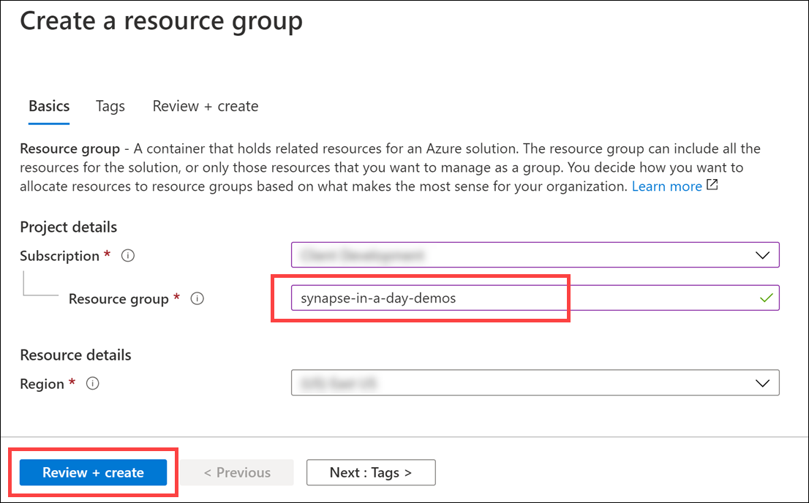

# Demo setup: Realize Integrated Analytical Solutions with Azure Synapse Analytics

**Contents**

<!-- TOC -->

- [Demo setup: Realize Integrated Analytical Solutions with Azure Synapse Analytics](#demo-setup-realize-integrated-analytical-solutions-with-azure-synapse-analytics)
  - [Requirements](#requirements)
  - [Before starting](#before-starting)
    - [Task 1: Create a resource group in Azure](#task-1-create-a-resource-group-in-azure)
    - [Task 3: Create Azure Synapse Analytics workspace](#task-3-create-azure-synapse-analytics-workspace)
    - [Task 4: Download artifacts](#task-4-download-artifacts)
    - [Task 5: Run Setup Script](#task-5-run-setup-script)
<!-- /TOC -->

## Requirements

1. An Azure Account with the ability to create an Azure Synapse Workspace

2. Make sure the following resource providers are registered for your Azure Subscription.  

   - Microsoft.Sql
   - Microsoft.Synapse
   - Microsoft.StreamAnalytics
   - Microsoft.EventHub  

    See [further documentation](https://docs.microsoft.com/en-us/azure/azure-resource-manager/management/resource-providers-and-types#azure-portal) for more information on registering resource providers on the Azure Portal.

3. A Power BI Pro or Premium account to host Power BI reports, dashboards, and configuration of streaming datasets.

## Before starting

### Task 1: Create a resource group in Azure

1. Log into the [Azure Portal](https://portal.azure.com) using your Azure credentials.

2. On the Azure Portal home screen, select the **+ Create a resource** tile.

    

3. In the **Search the Marketplace** text box, type **Resource group** and press the **Enter** key.

    

4. Select the **Create** button on the **Resource group** overview page.

5. On the **Create a resource group** screen, select your desired Subscription and Region. For Resource group, enter **synapse-in-a-day-demos**, then select the **Review + Create** button.

    

6. Select the **Create** button once validation has passed.

### Task 3: Create Azure Synapse Analytics workspace

1. Deploy the workspace through the following Azure ARM template (press the button below):

    <a href="https://portal.azure.com/#create/Microsoft.Template/uri/https%3A%2F%2Fraw.githubusercontent.com%2Fsolliancenet%2Fsynapse-in-a-day-deployment%2Fmaster%2Fdemos%2Fsetup%2Fartifacts%2Fenvironment-setup%2fautomation%2F00-asa-workspace-core.json" target="_blank"></a>

2. On the **Custom deployment** form fill in the fields described below.

   - **Subscription**: Select your desired subscription for the deployment.
   - **Resource group**: Select the resource group you previously created.
   - **Unique Suffix**: This unique suffix will be used naming resources that will created as part of your deployment. Make sure you follow correct Azure [Resource naming](https://docs.microsoft.com/en-us/azure/cloud-adoption-framework/ready/azure-best-practices/naming-and-tagging#resource-naming) conventions.
   - **SQL Administrator Login Password**: Provide a strong password for the SQLPool that will be created as part of your deployment. [Visit here](https://docs.microsoft.com/en-us/sql/relational-databases/security/password-policy?view=sql-server-ver15#password-complexity) to read about password rules in place. Your password will be needed during the next steps. Make sure you have your password noted and secured.
   - **Location**: The datacenter where your Azure Synapse environment will be created.
   
    > **Important**: The `location` field under 'Settings' will list the Azure regions where Azure Synapse Analytics (Preview) is available as of September 2020. This will help you find a region where the service is available without being limited to where the resource group is defined.

3. Check the **I agree to the terms and conditions stated above**, then select the **Purchase** button. The provisioning of your deployment resources will take approximately 13 minutes. **Wait** until provisioning successfully completes before continuing. You will need the resources in place before running the scripts below.

    > **Note**: You may experience a deployment step failing in regards to Role Assignment. This error may safely be ignored.

### Task 4: Download artifacts

> The WWI environment can be populated either with a large dataset with 30 billion records, or a smaller dataset with 3 million records. The loading time for the large dataset is 4-5 hours. If you are willing to load 30 billion records, follow the steps described in [Optional Features / 30 Billion Rows Dataset](#30-billion-rows-dataset).

1. Open a PowerShell Window, run the following command to download the artifacts

```PowerShell
mkdir c:\labfiles

cd c:\labfiles

git clone https://github.com/solliancenet/synapse-in-a-day-deployment.git synapse-in-a-day-deployment
```

### Task 5: Run Setup Script

1. In the PowerShell window, run the following:

    ```cli
    cd synapse-in-a-day-deployment\artifacts\environment-setup\automation

    .\01-environment-setup.ps1
    ```

2. You will be prompted to setup your Azure PowerShell and Azure CLI context.

3. You may be prompted to enter the name of your desired Azure Subscription. You can copy and paste the value from the list to select one. **Note**: Be certain to include the number next to the subscription name when you copy it.

    Select the resource group you selected during Task 2.2. This will make sure automation runs against the correct environment you provisioned in Azure.

    

    During the execution of the automation script you may be prompted to approve installations from PS-Gallery. Please approve to proceed with the automation.

    

    > **NOTE** This script will take up to 75 minutes to complete.

4. Sign in into the [Power BI Portal](https://powerbi.microsoft.com/en-us/) using your Azure credentials.

5. From the hamburger menu select **Workspaces** to access the list of workspaces available to you. Select your workspace.

    

6. Select the **Settings** icon from the top right bar, and select **Settings** again to navigate to the settings page.

    

7. Select **datasets** tab to access the list of datasets available. Then select `2-Billion Rows Demo` dataset to access its settings. From the settings page open **Data source credentials** and select **Edit credentials**.

    

8. Select **Microsoft Account** for the **Authentication method** and select **Sign In** to complete the process.

    

<!-- ### Task 8: Location Analytics Streaming Dataset Setup

1. Log into the [Azure Portal](https://portal.azure.com) using your Azure credentials.

2. On the Azure Portal home screen, go to **Search** and search for **locfunction**. Once the azure function is found select it to proceed.


3. Select **Functions** from the left menu to list the functions available in the function app. Next, select the function named **Start**.


4. In the **Overview** tab select **Get Function Url** and select **Copy to clipboard** to copy the Url for the function into your clipboard.


5. Open a new browser tab, paste the url and navigate to function endpoint to start location analytics data generator.


6. Once the Azure Function starts you can start building Power BI real-time reports for your new Power BI dataset. The name of the dataset is the value you provided during Task 2.4 of this setup guide.


### Task 9: Twitter Analytics Streaming Dataset Setup

1. Log into the [Azure Portal](https://portal.azure.com) using your Azure credentials.

2. On the Azure Portal home screen, go to **Search** and search for **tweets**. If you provided a different name for you Azure Stream Analytics Job use the same name for your search term.


3. Select **Start** to start the Azure Stream Analytics Job.


4. Once the job starts gathering data you can start building Power BI real-time reports for your new Power BI dataset that will be create by the Azure Stream Analytics job. The name of the dataset is based on the value you provided for the configuration parameter named **Streaming dataset** during template deployment.

### Task 10: Twitter Analytics Report

1. Launch [Power BI Desktop](https://powerbi.microsoft.com/en-us/desktop/) on your machine.

2. **Sign in** using your Power BI account credentials.


3. Select **Get Data** from the **Home** toolbar. Select **Power BI datasets** to proceed.


4. Select **Tweetsout** from the list of datasets. The name of the dataset is based on the value you provided for the configuration parameter named **Streaming dataset** during template deployment. It might be different in your case if you have changed the default value during deployment.

> Please note, it make take several minutes for this dataset to show up on the list. The Stream Analytics job you started in the previous task sends data to Power BI. There is an initial delay before the dataset initially appears after receiving the initial load of streaming data. If you do not see it listed, select Cancel to close this dialog, then re-open it.


5. To create **Tweets by City Visualization**, which is the count of neutral sentiment tweets over a geographical region, select the map icon from the Visualization tray.


6. Select **city**, **sentiment** and **tweet** fields to be included into the report. Move the **Tweet** field into the **Size** section.


7. Save your report locally, and then publish it to your workspace to be used during your demo. _This is the workspace you created in Task 1_.

### Task 11: Location Analytics Real-Time Report

1. Launch [Power BI Desktop](https://powerbi.microsoft.com/en-us/desktop/) on your machine.

2. **Sign in** using your Power BI account credentials.


3. Select **Get Data** from the **Home** toolbar. Select **Power BI datasets** to proceed.


4. Select **locationstream** from the list of datasets. The name of the dataset is the value you provided during Task 2.4 of this setup guide. It might be different in your case if you picked a different name.


5. To create a **Lined and stacked column Chart** for Avg Visit Time and Visitors by customer segment and department with the help of real-time data, select the map icon from the Visualization tray.


6. Select **CustomerSegment**, **DeptName**, **VisitorId** and **VisitTime** fields to be included into the report. 


7. Move **VisitTime** to Column Values and select to use its **average** value. Move **VisitorId** to Line values and select its **count** value to be used in the report.


8. Save and publish your report to your workspace to be used during your demo.

### Task 12: Power BI Dashboard 

1. Sign in into the [Power BI Portal](https://powerbi.microsoft.com/en-us/) using your Azure credentials.

2. Select **Workspaces** from the left menu and select the **CDP** workspace you previously created.


3. Name your dashboard **CDP**.

4. Select **Workspaces** from the left menu and select the **CDP** workspace you previously created.


5. Select **Phase2 CDP Vision Demo** report.

6. Select **Pin Visual** from any of the tiles available in the report to pin it into your dashboard.


7. Select the **CDP** dashboard and select **Pin**.


So far, you have pinned one tile from a single report to your dashboard. Feel free to navigate to different reports and pin the tiles you find appropriate to create your dashboard to achieve the look presented below.


The dashboard shown above has images used on the top row and the first column to the left. These images are available in a report called **Dashboard-images**. You can access all images from **Dashboard-images** to pin it into your design. -->

<!-- ## Optional Features

### 30 Billion Rows Dataset

The WWI environment can be populated with 30 billion records to demonstrated large data scenarios. Due to the limits of Azure Cloud Shell's 20-minute runtime, the automation has to run on a stand-alone machine against your subscription to be able to go through the 4-5 hours long data loading process. If you decide to go with the 30 billion records option, use a local Powershell instance with admin privileges instead of Azure Cloud Shell.

1. [Install Azure CLI](https://docs.microsoft.com/en-us/cli/azure/install-azure-cli?view=azure-cli-latest) and [Git](https://git-scm.com/downloads) to your computer.

2. Navigate to a folder location you prefer on your computer and execute the command below to download automation scripts and artifacts.


    ```PowerShell
    git clone https://github.com/microsoft/Azure-Analytics-and-AI-Engagement.git synapse-wwi
    ```
    
    

3. Execute the following command to authenticate your powershell session with your Azure Subscription:

    ```cli
    az login
    ```
    
4. Execute the following command to authenticate the script session with your Azure Subscription:

    ```cli
    Connect-AzAccount
    ```
    
5. Continue your environment setup from [Task 7 in the Before Starting guide](#task-7-run-environment-setup-powershell-script)).

### Twitter Developer Account Application

The Twitter Real-Time Analytics report in you created during task 10 can be connected to the real world, and fetch real-time tweets from twitter instead of the simulator deployed as part of your environment. In order to connect your report to Twitter you will need a Twitter Developer Account. Below are the steps to apply for one.

1. Visit [Twitter Developer Portal](https://developer.twitter.com/en/apply-for-access) to start your application for a Twitter Developer Account.

2. Select **Apply for a developer account** to start your application.


3. Select **Building B2B products** for your reason to build your application.


4. Make sure all information is correct and **Team developer account** is selected for your application.


5. In this step you will have to explain how you plan to use your developer account. Fill in your reasoning with your own words. Make sure you toggle the **Are you planning to analyze Twitter data** question **ON**.


6. During the next step you will be asked to confirm your e-mail by clicking a link in an e-mail sent to your e-mail address attached to your Twitter account. Select the link in your e-mail and verify your e-mail address.


7. Now your application is complete. It will be reviewed by Twitter, and you will receive a confirmation e-mail soon.


 -->
